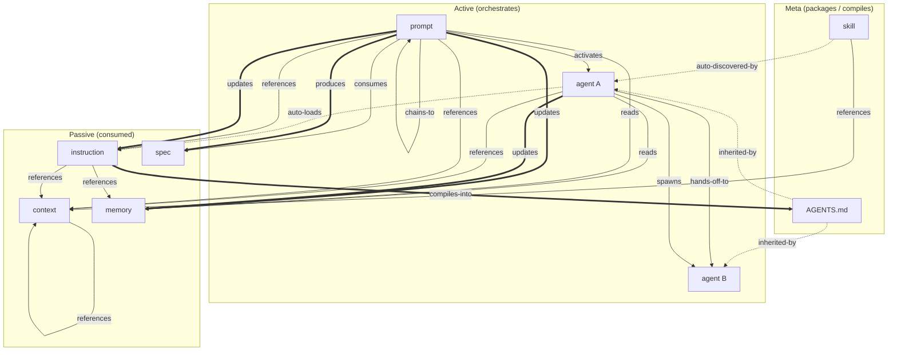

# Primitive Composability Chart

Source schema: [primitive-composability-schema.yaml](primitive-composability-schema.yaml)
See also: [matrix](primitive-composability-matrix.md)

## Directed Graph

Layered top-down: meta → active → passive. Flow follows gravity
except for two feedback loops (double arrows back upward).

## Legend

| Arrow | Meaning | Direction |
|-------|---------|-----------|
| `→` solid | Explicit reference or invocation | downward (with gravity) |
| `==>` double | Produce / write-back | upward (against gravity — feedback) |
| `-.->` dotted | Auto-load / auto-discover | implicit, pattern-triggered |

## Clarifications

**Agent → Agent** is not self-referential. Two distinct mechanisms:

- **Handoff**: Agent A completes its phase, passes context to Agent B
  (e.g., researcher → writer). Sequential, one active at a time.
- **Spawn**: Agent A creates a scoped subagent for a subtask,
  receives the result. Parent-child, concurrent.

**Prompt → Spec** has two distinct edges:

- **Consumes** (→): reads an existing spec as input to implementation.
- **Produces** (==>): a specification workflow creates a new spec file.

**Instruction → AGENTS.md → Agent** is a two-phase path:

- **Build-time**: `apm compile` merges instructions into AGENTS.md.
- **Runtime**: agents walk the directory tree and inherit the nearest AGENTS.md.

## Feedback Loops

The only two cycles in the graph:

1. **Learning**: prompt → memory → prompt
   Execution records decisions; future runs read them. Human-mediated —
   the same prompt instance does not read its own writes.

1. **Delegation**: agent A → agent B → agent C
   Handoffs and subagent spawning. Enables specialization without
   monolithic personas.

Everything else is strictly top-down: meta → active → passive.
